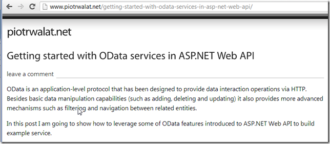
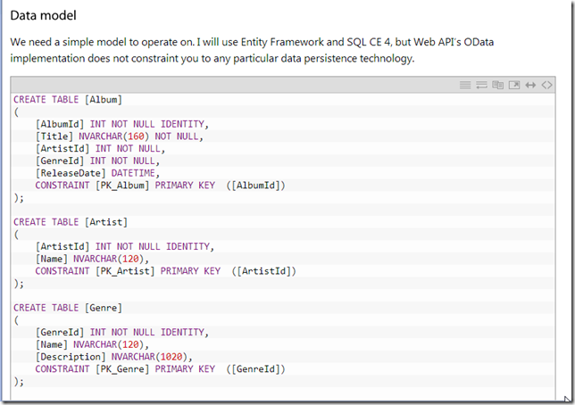

## OData ASP.NET Web API: An Mass Assignment vulnerability in the making?

When I saw [Getting started with OData services in ASP.NET Web API](http://www.piotrwalat.net/getting-started-with-odata-services-in-asp-net-web-api/) (via [reddit](http://www.reddit.com/r/dotnet/comments/171rrx/getting_started_with_odata_services_in_aspnet_web/)) :  

I immediately thought **Mass Assignment Vulnerability!**  

The part that raised my alarm was:

and

There are no mentions in that article of the words 'security' or 'mass assignment' so I wonder how much awareness there is for this issue?

**Anybody has cycles to test it out?**  

Is there any documentation for the OData ASP.NET Web API on this topic?

I couldn't find any references in [OData in WebAPI -- RC release](http://blogs.msdn.com/b/alexj/archive/2012/12/07/odata-in-webapi-rc-release.aspx) and [OData support in ASP.NET Web API](http://blogs.msdn.com/b/alexj/archive/2012/08/15/odata-support-in-asp-net-web-api.aspx)

**_Mass Assignment Vulnerability_ references:**  

  * [Mass assignment in Rails applications   « blog.mhartl | Michael Hartl's tech blog](http://blog.mhartl.com/2008/09/21/mass-assignment-in-rails-applications/) and [Finding and fixing mass assignment problems in Rails applications   « blog.mhartl | Michael Hartl's tech blog](http://blog.mhartl.com/2008/09/21/finding-and-fixing-mass-assignment-problems-in-rails-applications/)
  * [#26 Hackers Love Mass Assignment -- RailsCasts](http://railscasts.com/episodes/26-hackers-love-mass-assignment)
  * [Ruby on Rails Guides: Ruby On Rails Security Guide](http://guides.rubyonrails.org/security.html#mass-assignment)
  * [http://en.wikipedia.org/wiki/Mass_assignment_vulnerability](http://en.wikipedia.org/wiki/Mass_assignment_vulnerability)
  * [6 Ways To Avoid Mass Assignment in ASP.NET MVC](http://odetocode.com/blogs/scott/archive/2012/03/11/complete-guide-to-mass-assignment-in-asp-net-mvc.aspx)
  * [On Rails mass-assignment, Github and the apocalypse :: Labs :: Headshift](http://labs.headshift.com/2012/03/07/on-rails-mass-assignment-github-and-the-apocalypse/)
  * [OWASP Heiko Webers Ruby on Rails Security](https://www.owasp.org/images/2/26/Owasp-rails-security.pdf) (pdf)
  * [Newest 'mass-assignment' Questions - Stack Overflow](http://stackoverflow.com/questions/tagged/mass-assignment)

**_Auto-Binding Vulnerability_ references** (another name for Mass Assignment):  

  * ["Two Security Vulnerabilities in the Spring Framework's MVC" pdf (from 2008)](http://blog.diniscruz.com/2011/07/two-security-vulnerabilities-in-spring.html)
  * [Why ASP.NET MVC is 'insecure by design' , just like Spring MVC (and why SAST can help)](http://blog.diniscruz.com/2012/04/why-aspnet-mvc-is-insecure-by-design.html)
  * [Visualizing Spring MVC Annotations based Controls (and Autobinding PetClinic's vulnerabilities)](http://blog.diniscruz.com/2011/07/visualizing-spring-mvc-annotations.html)
  * [Solution for fixing Spring's JPetStore AutoBinding vulnerabilities](http://blog.diniscruz.com/2011/11/solution-for-fixing-springs-jpetstore.html)
  * [Dinis Cruz Blog: Current O2 support for analyzing Spring MVC](http://blog.diniscruz.com/2011/07/current-o2-support-for-analyzing-spring.html)
  * [Finally ... here is how I have been analysing Spring MVC apps using O2](http://blog.diniscruz.com/2011/07/finally-here-is-how-i-have-been.html)
  * [Tool - O2 Cmd SpringMVC v1.0.exe - as standalone exe](http://blog.diniscruz.com/2012/10/tool-o2-cmd-springmvc-v10exe-as.html)
  * [Starting to use the O2 Spring MVC viewer on ThreadFix](http://blog.diniscruz.com/2012/10/staring-to-use-o2-spring-mvc-viewer-on.html)
  * [ASP.NET MVC -- XSS and AutoBind Vulns in MVC Example app (from 2008)](http://blog.diniscruz.com/2012/12/aspnet-mvc-xss-and-autobind-vulns-in.html)
