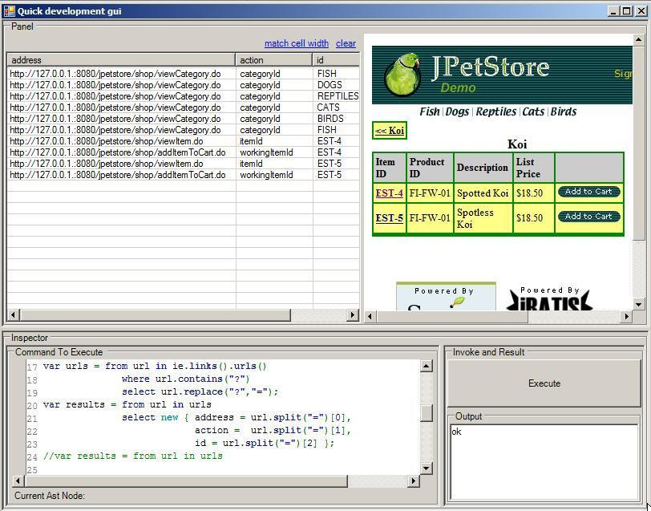

## Visualizing the links in JPetStore (Spring MVC)

One of the pains of writing web automation scripts for JPetStore is its almost lack of HTML ID tags, which make it very hard to get strong references to the desired (for example) links.

The script below show an IE Automation sequence that will end up in a page where we will grab the links and visualize a possible analysis of its link data:

Here is the script that creates the GUI:

**TODO: FIX CODE BELOW**

{lang="csharp"}
[sourcecode language="csharp" wraplines="false"] var topPanel = panel.clear().add_Panel(); var ie = topPanel.add_IE().silent(true); ie.open("http://127.0.0.1.:8080/jpetstore"); ie.link("Enter the Store").click(); var mappings = new Dictionary<string, string>(); foreach(var url in ie.links().urls())     if(url.contains("categoryId"))            mappings.add(url.split("=")[1], url);         ie.open(mappings["FISH"]);          ie.link("FI-FW-01 ").click(); var tableList = topPanel.insert_Left(400).add_TableList(); var urls = from url in ie.links().urls()               where url.contains("?")                        select url.replace("?","="); var results = from url in urls               select new { address = url.split("=")[0],                              action =  url.split("=")[1],                              id = url.split("=")[2] };               tableList.show(results); //ie.inject_jQuery();  //ie.inject_FirebugLite(); //return ie.fields(); return "ok"; //O2File:WatiN_IE_ExtensionMethods.cs //using O2.XRules.Database.Utils.O2 //O2Ref:WatiN.Core.1x.dll [/sourcecode] Here is a follow-up script where we create a dictionary that maps the product type to a link: [sourcecode language="csharp" wraplines="false"] var topPanel = panel.clear().add_Panel(); var ie = topPanel.add_IE().silent(true); ie.open("http://127.0.0.1.:8080/jpetstore"); ie.link("Enter the Store").click(); var mappings = new Dictionary<string, string>(); foreach(var url in ie.links().urls())     if(url.contains("categoryId"))            mappings.add(url.split("=")[1], url);         ie.open(mappings["FISH"]);          ie.link("FI-FW-01 ").click(); //O2File:WatiN_IE_ExtensionMethods.cs //using O2.XRules.Database.Utils.O2 //O2Ref:WatiN.Core.1x.dll [/sourcecode]
