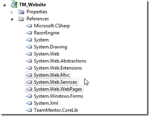
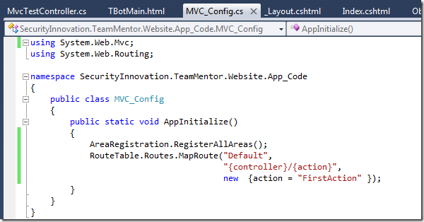
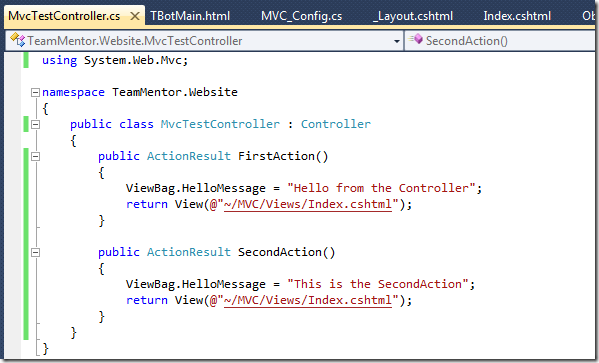
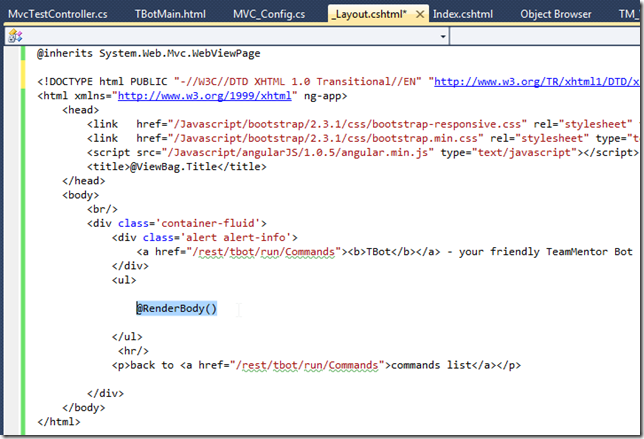
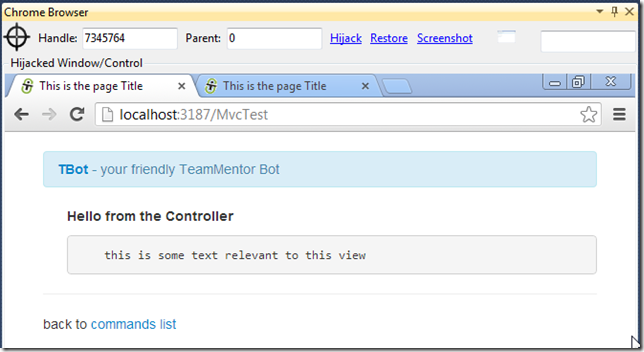
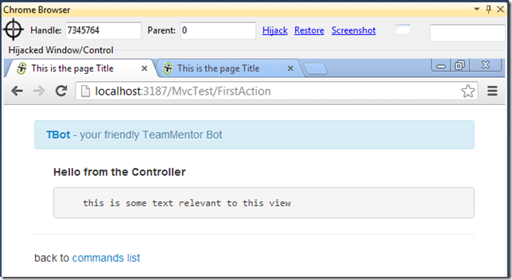

## Using ASP.NET MVC 4.0 in TeamMentor (with simple Controller, View and master Layout)

On _TeamMentor's_ 3.3. release we added support for C# **_RazorEngine_** and **System.Web.Razor.**

For 3.4 release, there is requirement to add Markdown support (see next post). Since the API that I want to use ([MarkdownDeep](http://www.toptensoftware.com/markdowndeep/)) works really well with **_ASP.NET MVC 4.0_**, here is how I added **_ASP.NET MVC 4.0_** support to TeamMentor.

The process was quite smooth, and I was able to quickly get it up and running.

It all started with NuGet where I added this package

Which (after Resharper optimization) results in two MVC dependencies (**_System.Web.MVC_** and **_System.Web.WebPages_**)

_UPDATE: Azure required a couple more MVC dependencies_  

Since one of my objectives in adding this library is to not touch the **_TeamMentor.CoreLib_** assembly (which is where the global.asax.cs file is), I used the [Asp.Net App_Code AppInitialize non-documented featured (invoked before Application_Start)](https://www.blogger.com/blog.diniscruz.com/2013/01/aspnet-appcode-appinitialize-non.html) technique to register the main Routes on an file called **_MCV_Config.cs_** added to the **_App_Code_** folder:

I then added a **_MvcTestController.cs_** file with a controller class with two methods

... and a view called _**Index.cshtml **_(located in the **_/Mvc/Views/*_** folder instead of the default _**/Views/MvcTest/***_ folder)

... and a master view called **__layout.cshtml_** (referenced from the **_Index.cshtml_** razor file shown above)

... and that is it :)

The **__layout.cshtml_** file is basically the **_AngularJS_** main page used by _**_TBot,_** _with all the **_ASP.NET MVC _**interaction happening with the **_@RenderBody_** command (shown above)

After compiling the project, here is what the [http://localhost:3187/MvcTest](http://localhost:3187/MvcTest) looks like ([in Chrome inside VisualStudio](http://blog.diniscruz.com/2013/03/using-chrome-inside-native-visualstudio.html))

We can also access the same page on [http://localhost:3187/MvcTest/FirstAction](http://localhost:3187/MvcTest/FirstAction)

And open the other controller method at  [http://localhost:3187/MvcTest/SecondAction](http://localhost:3187/MvcTest/SecondAction)

