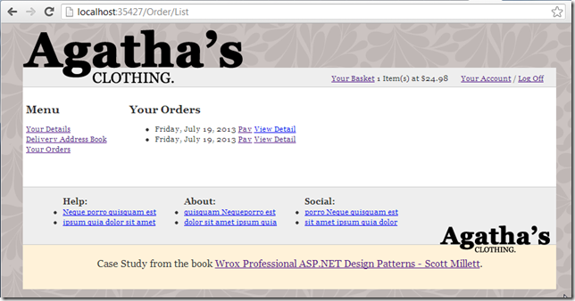
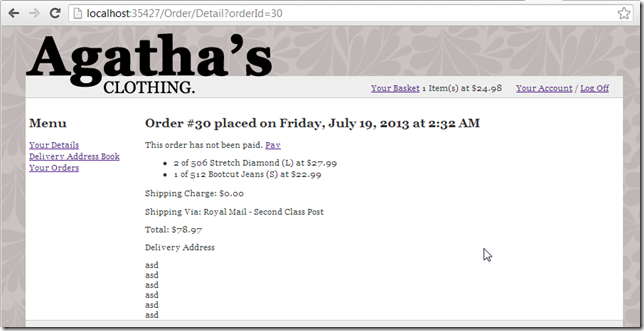
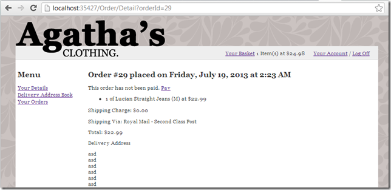
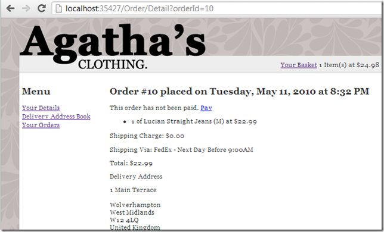
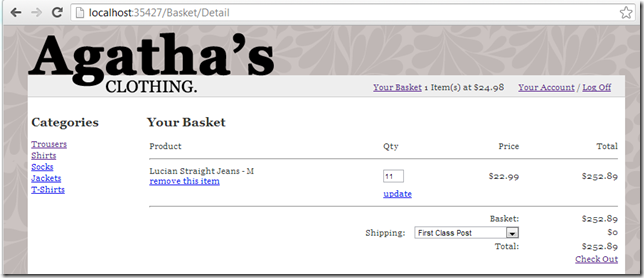

## Nice business logic vulnerability and CSRF on the ASP.NET MVC Design Patterns book sample

Following a [comment on this reddit thread](http://www.reddit.com/r/dotnet/comments/1iiq67/can_you_spot_the_security/) I did a search for '_ASP.NET MVC Design'_ patterns and found the site [https://aspnetdesignpatterns.codeplex.com](https://aspnetdesignpatterns.codeplex.com/) which is from the Wrox [Professional ASP.NET Design Patterns](http://www.wrox.com/WileyCDA/WroxTitle/Professional-ASP-NET-Design-Patterns.productCd-0470292784.html) book.

Since it looked like a nice MVC application, I grabbed a copy of the source code, upgraded it to .NET 4.0/MVC 4.0 ([now on GitHub here](https://github.com/o2platform/Fork_AgathasStorefront_ASPNET_MVC)) and had a quick look for [MVC ModelBinding vulnerabilities](http://blog.diniscruz.com/2013/07/can-you-spot-security.html).

And although it looks like the app is NOT vulnerable to MVC Model injections, that is mainly because there are very few controllers that use ModelBinding (i.e. that Design Pattern was not used (which ironically is my main recommendation to deal with MVC ModelBinding Vulnerabilities: don't use Model Binding :)  )).

**Insecure Direct Object References**

While looking for ModelBinding issues, I also had a look for the [Top 10 2013-A4-Insecure Direct Object References](https://www.owasp.org/index.php/Top_10_2013-A4-Insecure_Direct_Object_References) and found a nice example of what not to do.

Here is the user page with the past orders

.... here is the page where I can see the 1st order (for the current user)

.... and here is the 2nd order:

... spot any probs so far?

Here is the controller that handles that request:

Since this controller asks for an **_orderId_** (which as seen above, in our current user's case was 29 and 30), where is the code that checks that the requested **_orderId_** belongs to the current user?

]

.... well since in this case it is not there

... it is possible to see other customer's orders (and shipping address)

Which makes for a nice example of an business logic vulnerability, where the request data is valid, but we are accessing information that shouldn't be visible to the current logged in user.

The solution for this vulnerability is to [Use Indirect Object References](https://services.teammentor.net/teamMentor#load:22dc0732-ec5e-4600-9a1c-97d0f83545f7)

**CSRF**  

This app is also vulnerable to CSRF ([Cross Site Request Forgery](https://services.teammentor.net/teamMentor#load:22dc0732-ec5e-4600-9a1c-97d0f83545f7))

Here is the raw HTTP Request (with only a valid session ID and Basket)

...which changed the current total of items we're buying to 11:

**Bad error handing:**

This app also could do a much better job  

... at handling malformed data

... with some errors only caught on the view (due to lack of data in the model)

**XSS via product data**  

Talking about the views, this app does a pretty good job at using HtmlEncode on the views, except on this page:

Which means that XSS payloads could be introduced via the product database (normally managed via other systems/websites)

**Is there more?**  

Probably, and it would be interesting to find and fix them ([grab the code from GitHub and have a go](https://github.com/o2platform/Fork_AgathasStorefront_ASPNET_MVC))
