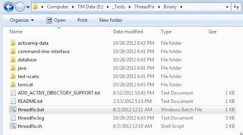
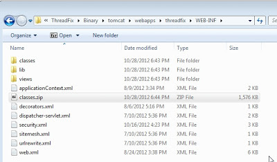
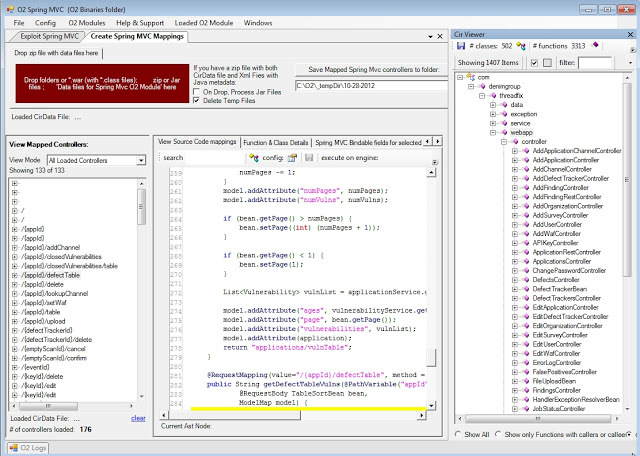
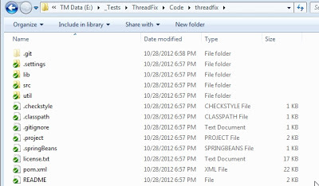
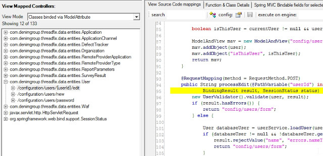
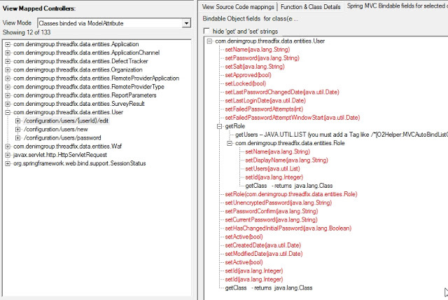

## Starting to use the O2 Spring MVC viewer on ThreadFix

Using the [Tool - O2 Cmd SpringMVC v1.0.exe](https://dl.dropbox.com/u/81532342/O2Platform%20Tools/Spring%20MVC/Tool%20-%20O2%20Cmd%20SpringMVC%20v1.0.exe)  (see more details on this post: [Tool - O2 Cmd SpringMVC v1.0.exe - as standalone exe](http://diniscruz.blogspot.co.uk/2012/10/tool-o2-cmd-springmvc-v10exe-as.html)) here is how to start using it on [ThreadFix ](http://code.google.com/p/threadfix/) from Denim Group (_"ThreadFix is a software vulnerability aggregation and management system that helps organizations aggregate vulnerability data, generate virtual patches, and interact with software defect tracking systems."_)

I downloaded the ThreadFix binaries from the [download page](http://code.google.com/p/threadfix/downloads/list) : [ThreadFix_1_0_1.zip](http://code.google.com/p/threadfix/downloads/detail?name=ThreadFix_1_0_1.zip&can=2&q=)  
And since I couldn't find a download for the source code, I used git by executing:**_ $ git clone https://code.google.com/p/threadfix/_**

  
Then I unzipped the [ThreadFix_1_0_1.zip](http://code.google.com/p/threadfix/downloads/detail?name=ThreadFix_1_0_1.zip&can=2&q=)  files into a local folder and executed 'threadfix.bat'

This will start tomcat, and more importantly extract the threadfix.war file into the webapps folder, where I zipped the classes folder:

  
which I then dropped into the O2 Spring MVC tool:

The first time there is a source code to be opened in the document viewer area, you will be asked to resolve the files, which in this case it points to here:

Interestingly there is quite a lot meat here. For example, if you look for the ModelAttribute mappings there is quite a lot cases where they use this dangerous coding technique:

With some of the model classes looking quite big, there could be a number of spring [mvc autobinding issues](http://diniscruz.blogspot.co.uk/2011/07/two-security-vulnerabilities-in-spring.html) here:

  

  

