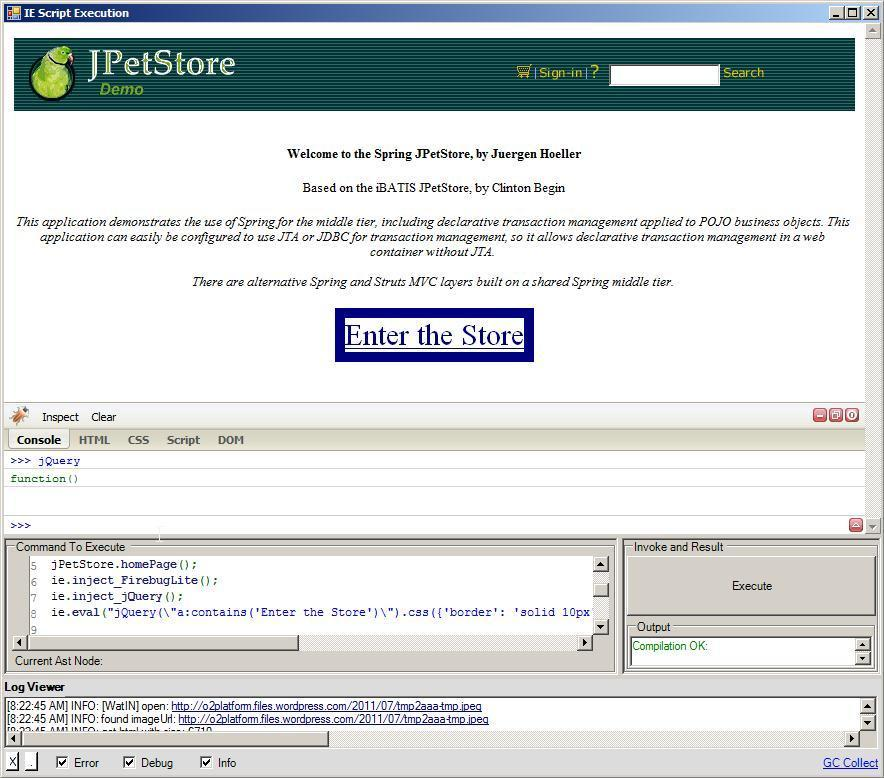

## Injecting FirebugLite and jQuery into a IE Automation page (JPetStore Example)

When doing IE Automation, sometimes the best way to find out what is happening at the page we're working on is to open FireBug on it. A cool (and very powerfull) alternative is to use FirebugLite which can be embeded on any page and works on most browsers. As you can see here [http://getfirebug.com/firebuglite#Stable](http://getfirebug.com/firebuglite#Stable) one way to fireup FirebugLite is to execute that bit of Javascript they show under the _'Add the following link to your bookmarks_:' section. When using O2's IE Automation this can be achieved like this:

**TODO: FIX CODE BELOW**

{lang="csharp"}
[sourcecode language="csharp" wraplines="false"] var firebugLiteScript = &amp;quot;(function(F,i,r,e,b,u,g,L,I,T,E){if(F.getElementById(b))return;E=F[i+'NS']&amp;amp;&amp;amp;F.documentElement.namespaceURI;E=E?F[i+'NS'](E,'script'):F[i]('script');E[r]('id',b);E[r]('src',I+g+T);E[r](b,u);(F[e]('head')[0]||F[e]('body')[0]).appendChild(E);E=new Image;E[r]('src',I+L);})(document,'createElement','setAttribute','getElementsByTagName','FirebugLite','4','firebug-lite.js','releases/lite/latest/skin/xp/sprite.png','https://getfirebug.com/','#startOpened');&amp;quot;; ie.eval(firebugLiteScript ); [/sourcecode] And since that works, let's add it as an Extension method to the WatiN_ExtensionMethods.cs file that is used on the IE Automation script: [sourcecode language="csharp" wraplines="false"] public static class WatiN_IE_ExtensionMethods_FireBugLite { public static WatiN_IE inject_FirebugLite(this WatiN_IE ie) { var firebugLiteScript = &amp;quot;(function(F,i,r,e,b,u,g,L,I,T,E){if(F.getElementById(b))return;E=F[i+'NS']&amp;amp;&amp;amp;F.documentElement.namespaceURI;E=E?F[i+'NS'](E,'script'):F[i]('script');E[r]('id',b);E[r]('src',I+g+T);E[r](b,u);(F[e]('head')[0]||F[e]('body')[0]).appendChild(E);E=new Image;E[r]('src',I+L);})(document,'createElement','setAttribute','getElementsByTagName','FirebugLite','4','firebug-lite.js','releases/lite/latest/skin/xp/sprite.png','https://getfirebug.com/','#startOpened');&amp;quot;; ie.eval(firebugLiteScript); return ie; } } [/sourcecode] While we are here lets also add jQuery directly (without the need to use the IE_JQuery.cs api) [sourcecode language="csharp" wraplines="false"] ie.eval(&amp;quot;&amp;lt;a href=&amp;quot;http://code.jquery.com/jquery-1.6.2.min.js%22.uri().getHtml&amp;quot;&amp;gt;http://code.jquery.com/jquery-1.6.2.min.js&amp;quot;.uri().getHtml&amp;lt;/a&amp;gt;()); [/sourcecode] or as an extension method: [sourcecode language="csharp" wraplines="false"] public static class WatiN_IE_ExtensionMethods_JQuery { public static WatiN_IE inject_jQuery(this WatiN_IE ie) { ie.eval(&amp;quot;&amp;lt;a href=&amp;quot;http://code.jquery.com/jquery-1.6.2.min.js%22.uri().getHtml&amp;quot;&amp;gt;http://code.jquery.com/jquery-1.6.2.min.js&amp;quot;.uri().getHtml&amp;lt;/a&amp;gt;()); return ie; } } [/sourcecode]

Putting it all together, here is a script that:

  *  opens up JPetStore
  * Injects FirebugLite
  * Injects jQuery
  * runs a jQuery command that:

    * selects an 'a' with the content 'Enter the Store'
    * changes its border to 2px
    * changes it size to 20px
    * fades it out in 2000 ms
    * fades is it in 2000 ms

**TODO: FIX CODE BELOW**

{lang="csharp"}

[sourcecode language="csharp" wraplines="false"] var topPanel = panel.clear().add_Panel(); var ie = topPanel.add_IE().silent(true); var jPetStore = new API_JPetStore(ie); jPetStore.homePage(); ie.inject_FirebugLite(); ie.inject_jQuery(); ie.eval(&amp;quot;jQuery(\&amp;quot;a:contains('Enter the Store')\&amp;quot;).css({'border': 'solid 10px', 'font-size' : 30 } ).fadeOut(2000).fadeIn(2000);&amp;quot;);&amp;lt;/pre&amp;gt; &amp;amp;nbsp; //O2File:API_JPetStore.cs //O2File:WatiN_IE_ExtensionMethods.cs //using O2.XRules.Database.Utils.O2 //O2Ref:WatiN.Core.1x.dll [/sourcecode] Here is a screenshot what what this looks like: 
