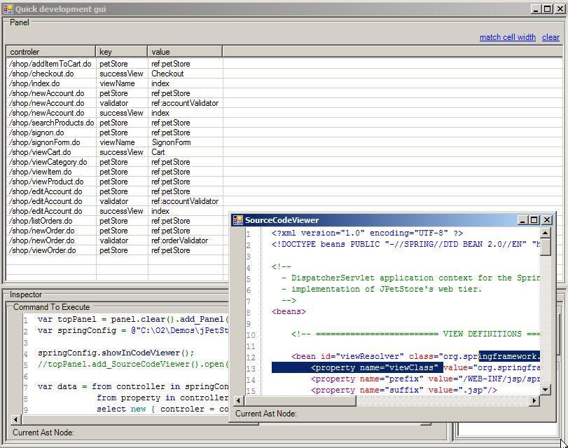
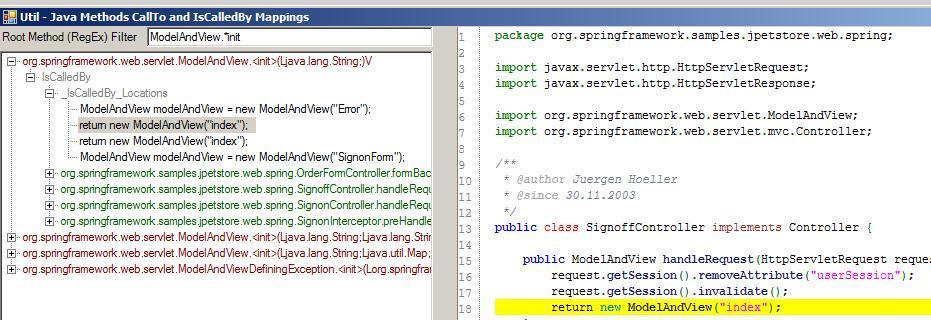
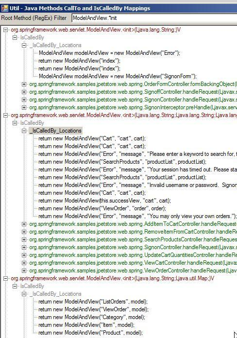
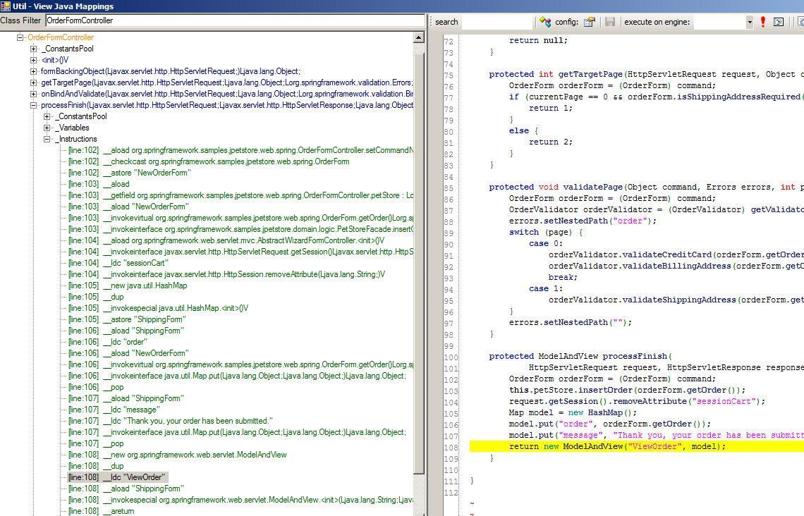
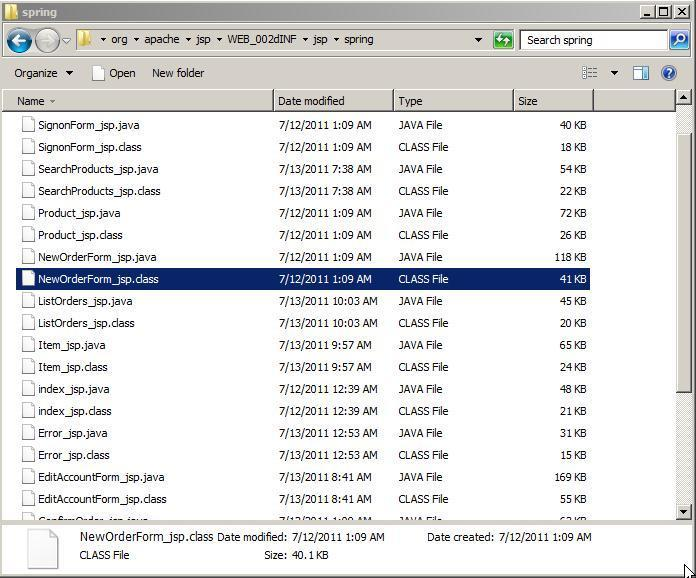

## Finding the JSP views that are mapped to controlers in JPetStore (Spring MVC)

One of the topics that was discussed at yesterday's O2 WebCast was ***'how to find the JSPs that are mapped to a controller?'*** This is a very important piece of the puzzle since that is one of the few ways we can try to have a fell for the size of the Spring Auto-Binding vulnerabilities (since one of the analysis that needs to be done is the cross-check between what is on the *.jsps and what the Spring MVC engine will autobind into the assigned CommandClass POJO. The first place to look is on the Spring config file, and here is a script that does exactly that:

**TODO: FIX CODE BELOW**

{lang="csharp"}

[sourcecode language="csharp" wraplines="false"] var topPanel = panel.clear().add_Panel(); var springConfig = @"C:\O2\Demos\jPetStore - O2 Demo Pack\sourceCode\war\WEB-INF\petstore-servlet.xml";</pre> &nbsp; springConfig.showInCodeViewer(); //topPanel.add_SourceCodeViewer().open(springConfig); var data = from controller in springConfig.springMvcMappings().Controllers             from property in controller.Properties             select new { controler = controller.HttpRequestUrl , key = property.Key, value = property.Value };             topPanel.add_TableList().show(data); //return springConfig.springMvcMappings().Controllers[0].Properties[0];  //using O2.XRules.Database.Languages_and_Frameworks.J2EE //using O2.XRules.Database.APIs.IKVM //O2File:spring-servlet-2.0.xsd.cs //O2File:SpringMvcMappings_v2.0.cs //O2Ref:O2_Misc_Microsoft_MPL_Libs.dll [/sourcecode]

When executed this script will open up the local petstore-servlet.xml config file and show a mapping the bean URLs and its property values

As the table created clearly shows, in this application (and this tend to be unique per app) we can't use the spring config file to fully map the Controller's views (there are a couple that can be resolved using this method, but there are a lot of missing mappings).

A quick look at one of the controllers shows the most likely solution

Which is the fact that the view seems to be set by the constructor of the ModeAndView object:

**TODO: FIX CODE BELOW**

{lang="csharp"}
[sourcecode language="csharp" wraplines="false"]         return new ModelAndView("ViewOrder", model); [/sourcecode]

The question now is: "How often was this pattern used in JPetStore?".

A first look looks that is common

Which is confirmed when looking at the other ModelAndView constructors:

So to correctly map these Jsps we are going to have to programmatically retrieve the first string value of the ModelAndView constructor and map it to the correct controller. This can be done using the metadata that is exposed from the O2 Java Static Analysis Engine (in the screenshot below note the string value two instructions before the call to the ModelAndView constructor):

Once we have the Jsps we will need to find the fields that are used inside that Jsps. At the moment O2 doesn't have a JSP file parser, but this information should be also retrievable from the created \*.class files, which in this case can be found in Tomcat's temp folder  (***C:\O2\Demos\jPetStore - O2 Demo Pack\apache-tomcat-7.0.16\work\Catalina\localhost\jpetstore\org\apache\jsp\WEB_002dINF\jsp\spring***):

